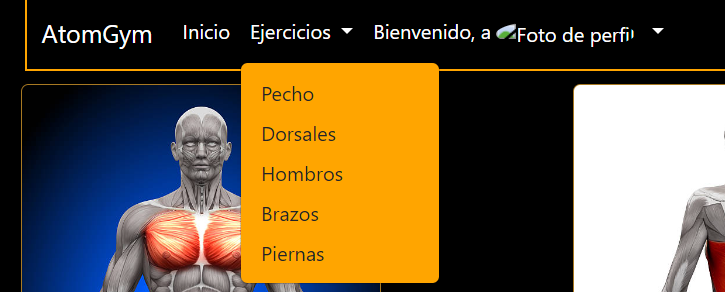
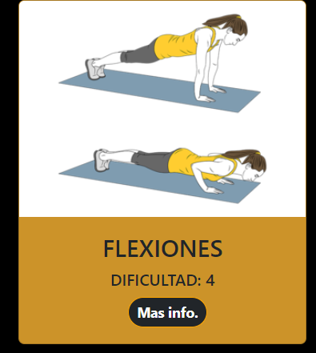
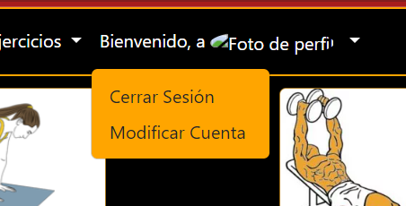

# Proyecto: EntrenoPHP
Autor: Jose Antonio Holgado Bonet 
Proyecto de entrenamiento PHP y SQL  
El propósito es desarrollar una plataforma online para la gestión y acceso de entrenamientos físicos

## Descripción

El proyecto consiste en una web que muestra ejercicios según el grupo muscular buscado. Por ejemplo, busco ejercicios de pectoral y muestra todos los ejercicios de dicho miembro. Además, en cada ejercicio aparece un botón que nos proporciona la información para ejecutar el ejercicio

El diseño del CRUD consiste: el usuario y al admin pueden registrarse, logearse, modificar sus datos y eliminar su cuenta en la web. 

## Tabla de Contenidos

- [Instalación](#instalación)
- [Diseño SQL](#diseño-sql)
- [Uso](#uso)
- [Datos de Interes](#datos-de-interes)
- [Implementaciones extras](#implementacion-extras)

## Instalación

Para instalar y ejecutar este proyecto, sigue estos pasos:

1. Asegúrate de tener instalado `composer` en tu sistema. Si no lo tienes, puedes descargarlo desde [aquí](https://getcomposer.org/download/).

2. Clona este repositorio en tu máquina local usando `git clone`.

3. Navega hasta el directorio del proyecto.

4. Ejecuta `composer install` para instalar las dependencias del proyecto. Esto utilizará el archivo `composer.lock` que ya está en el repositorio para instalar las versiones correctas.

5. Si es necesario, ejecuta `composer require nombre-de-la-dependencia` para cada dependencia adicional que necesites.

6. Finalmente, ejecuta `composer dump-autoload -o` para generar el directorio `vendor` y el archivo de autoload.

7. El proyecto incluye un script SQL adjunto. Utiliza este script para crear y poblar la base de datos.

8. Modifica el archivo `conexion.php` que se encuentra en el directorio de `librerias`. Deberás actualizar la configuración para que apunte a la base de datos que deseas utilizar.

Ahora deberías poder ejecutar el proyecto en tu entorno local.

## Diseño SQL

Se añade el script SQL generado por phpMyAdmin que contiene comandos para crear y poblar base de datos. A continuación , se explican las secciones más importantes del script:

1. Estructura de tablas: Define las tablas `musculo`, `entrenamiento`, `usuario`, y `administrador` con sus respectivas columnas, tipos de datos y restricciones. Establece relaciones utilizando claves primarias y foráneas para mantener la integridad de los datos.

2. Volcado de datos: Contiene comandos INSERT INTO para añadir registros a las tablas creadas. Esto incluye ejercicios de entrenamiento, usuarios y administradores con sus respectivas credenciales y detalles.

3. Índices y AUTO_INCREMENT: Agrega índices para mejorar el rendimiento de las consultas y define incrementos automáticos para las claves primarias de las tablas.

4. Comandos de control de caracteres y codificación: Establece configuraciones de juego de caracteres y collation para la interpretación adecuada de los datos almacenados.

## Uso

Teniendo en cuenta que se empleo el script SQL adjunto para crear y poblar la base de datos, se disponen los siguientes usuarios de prueba.

1. Para el usuario`jose@prueba.com` con la contraseña `1234` y para el admin `admin@prueba.com` con la contraseña `1234`.

2. En caso de querer añadir a mano mediante SQL un nuevo usuario, tener en cuenta que las contraseñas se encriptan en `password_hash` desde el servidor.

3. En el mismo poblado se incluyen articulos ya creados y puntuados para que se pueda probar directamente su uso.

4. Para crear un nuevo usuario se debe realizar desde el formulario de registro `/registro` y para logearse desde el formulario de login en `/login`.

5. El listado principal de todos los musculos se encuentra en `/main` mientras que el listado de los ejercicios individuales se encuentra en `/mainEjercicios`. Por otra parte, desde el nav hay un despliegue de todos los músculos para acceder más rápidamente desde cualquier para dentro de la pagina.
   

7. Es posible ver la descripcion de un ejercicio en concreto pinchando en `+info`.
   

9. Para editar los datos del usuario se emplean en el nav justo al pinchar en su nombre llamado `modificar usuario`.
    

11. Puedes cerrar la sesión del usuario (se muestra en la imagen anterior)

12. Al clicklar encima de inicio te reedirige al main (la muestra de todos los músculos)

## Datos de Interes

1. La web esta desplegada [aquí](https://atomgym.duckdns.org/). Sin embargo es necesario encender la maquina EC2 de amazon donde esta hosteada de momento. Contacte conmigo en caso de querer disponer de ella para que encienda la maquina.

2. La arquitectura del proyecto se basa en el patrón de diseño MVC, utilizando la extensión Mysqli para interactuar con la base de datos.

3. También se ha hecho uso de extensiones Twig, específicamente la implementación de la interfaz `GlobalsInterface` para facilitar la manipulación y presentación de datos en las vistas.

4. Se ha implementado javascripts para el uso de alerts y el despliegue, en el nav, de los musculos y del usuario(`Se observa con un triángulo hacia abajo`). 

5. Se ha implementado el patrón Singleton para el control de sesiones permitiendo unificar y controlar de manera consistente el manejo de la sesión en toda la aplicación. Además, se  implementa un control más riguroso y seguro sobre las variables de sesión, lo que contribuye a fortalecer la seguridad de la aplicación.

## Implementaciones extras
1. Se ha complementado de que el usuario pueda subir una imagen al servidor y aparezca dicha imagen en el nav.

2. Que aparezca el nombre del usuario registrado en el nav.

3. Que la sesión expire y te reedirija al login cada 60 sg.

4. Verificación constantes de tokens y reseteo tras verificarlo para más seguridad.

5. Implementación de alert cuando el usuario haga se registre, no rellene los campos, se acabe la sesión...
